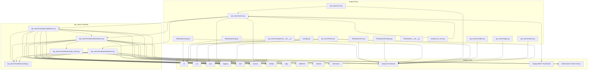

```mermaid
graph TD
    subgraph Django Core
        Django[Django Framework]
        DRF[Django REST Framework]
        ElasticsearchClient[Elasticsearch Client Library]
    end

    subgraph External Libraries
        OS[os]
        Sys[sys]
        Json[json]
        Logging[logging]
        Time[time]
        Asyncio[asyncio]
        Aiohttp[aiohttp]
        Copy[copy]
        Datetime[datetime]
        Random[random]
        Collections[collections]
    end

    subgraph Project Files
        MNG[manage.py]
        API_ADM[api_search/admin.py]
        API_APP[api_search/apps.py]
        API_MOD[api_search/models.py]
        API_TEST[api_search/tests.py]
        API_URLS[api_search/urls.py]
        API_VIEWS[api_search/views.py]
        API_INIT_MIGR[api_search/migrations/__init__.py]
        WAS_ASGI[WASproject/asgi.py]
        WAS_SETTINGS[WASproject/settings.py]
        WAS_URLS[WASproject/urls.py]
        WAS_WSGI[WASproject/wsgi.py]
        WAS_INIT[WASproject/__init__.py]
        GUNI_CONF[ini/gunicorn_conf.py]
    end

    subgraph api_search.modules
        CLASSIFY_SKEYS[api_search/modules/classify_skeys.py]
        CONFIG[api_search/modules/config.py]
        IDS_SEARCH[api_search/modules/IdsSearch.py]
        MAIN_SEARCH[api_search/modules/MainSearch.py]
        TAG_SEARCH[api_search/modules/TagSearch.py]
    end

    MNG --> OS
    MNG --> Sys
    MNG --> Django

    API_ADM --> Django
    API_APP --> Django
    API_MOD --> Django

    API_TEST --> Json
    API_TEST --> Django
    API_TEST --> Logging

    API_URLS --> Django
    API_URLS --> API_VIEWS

    API_VIEWS --> DRF
    API_VIEWS --> API_VIEWS
    API_VIEWS --> MAIN_SEARCH
    API_VIEWS --> TAG_SEARCH
    API_VIEWS --> IDS_SEARCH
    API_VIEWS --> Logging
    API_VIEWS --> Asyncio

    CLASSIFY_SKEYS --> Logging
    CLASSIFY_SKEYS --> Collections
    CLASSIFY_SKEYS --> Django
    CLASSIFY_SKEYS --> CONFIG

    IDS_SEARCH --> Django
    IDS_SEARCH --> ElasticsearchClient
    IDS_SEARCH --> Time
    IDS_SEARCH --> Asyncio
    IDS_SEARCH --> Logging
    IDS_SEARCH --> Aiohttp
    IDS_SEARCH --> Copy
    IDS_SEARCH --> CONFIG

    MAIN_SEARCH --> Django
    MAIN_SEARCH --> ElasticsearchClient
    MAIN_SEARCH --> Time
    MAIN_SEARCH --> Asyncio
    MAIN_SEARCH --> Logging
    MAIN_SEARCH --> Aiohttp
    MAIN_SEARCH --> Copy
    MAIN_SEARCH --> CONFIG
    MAIN_SEARCH --> CLASSIFY_SKEYS
    MAIN_SEARCH --> Json
    MAIN_SEARCH --> Datetime
    MAIN_SEARCH --> Random

    TAG_SEARCH --> ElasticsearchClient
    TAG_SEARCH --> Time
    TAG_SEARCH --> Asyncio
    TAG_SEARCH --> Logging
    TAG_SEARCH --> Aiohttp
    TAG_SEARCH --> Copy
    TAG_SEARCH --> Django
    TAG_SEARCH --> CONFIG
    TAG_SEARCH --> MAIN_SEARCH
    TAG_SEARCH --> Json

    WAS_ASGI --> OS
    WAS_ASGI --> Django

    WAS_SETTINGS --> Django

    WAS_URLS --> Django

    WAS_WSGI --> OS
    WAS_WSGI --> Django
```
